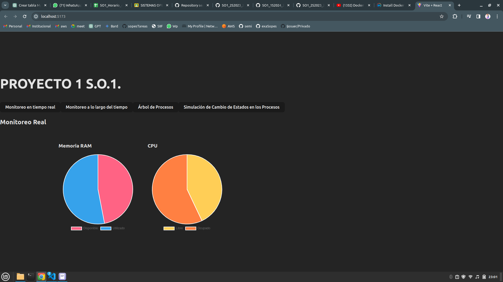
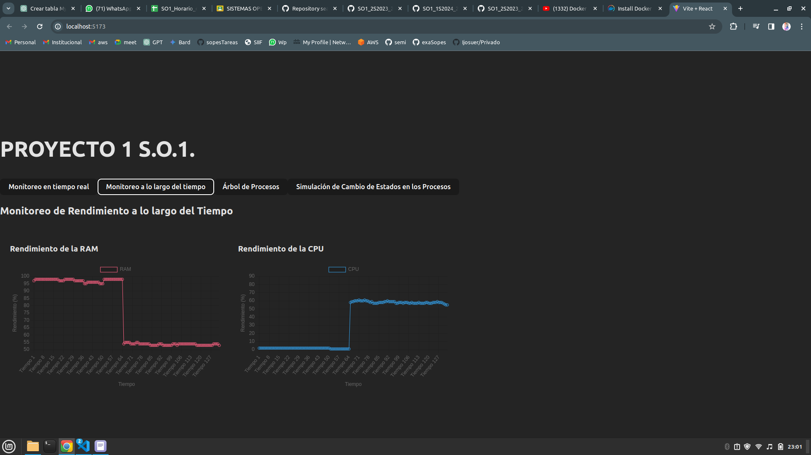
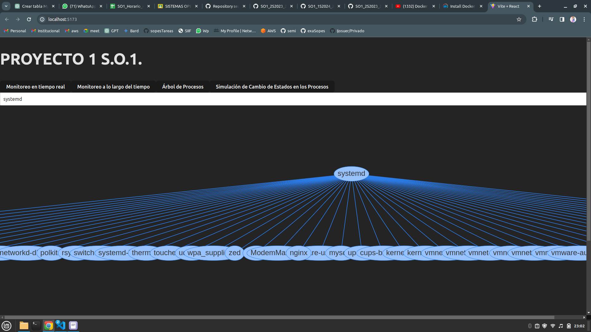
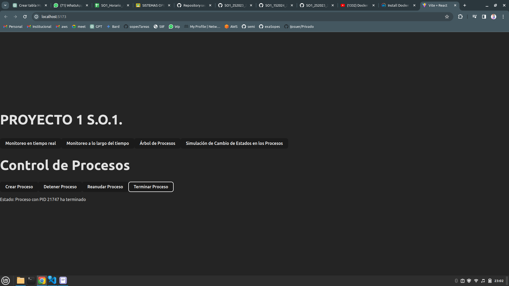

# 
 MANUAL TECNICO 

### 
 Proyecto 1 - Sistemas Operativos 1

**Autor:** Wilber Steven Zúñiga Ruano
**Carnet:** 202006629

## Máquina Virtual de Monitoreo

**Descripción:**

Esta máquina virtual se encarga de monitorear el estado de las máquinas virtuales que se encuentran en el autoscaling de GCP. Para esto, se utiliza el servicio desarrollado, el cual permite monitorear el estado de las máquinas virtuales, así como también de los servicios que se encuentran corriendo en estas.

**Contenido:**

* Utiliza Docker Compose para levantar los servicios de contenedores.
* **Servicios:**
    * Plataforma de monitoreo (Frontend en React): Monitorea el estado de las máquinas virtuales y los servicios que se ejecutan en ellas.
    * Base de datos (Volumen a partir de una imagen de MySQL): Almacena la información de las máquinas virtuales.
    * **API (Backend en Go):** Exporta los datos de la base de datos a través de una API REST.

**Servicios de la Máquina Virtual:**

**3.1. Plataforma de Monitoreo:**

* Monitoreo en tiempo real: Muestra el estado actual de las máquinas virtuales y los servicios que se ejecutan en ellas.

* Monitoreo histórico: Muestra el estado de las máquinas virtuales en un periodo de tiempo determinado.

**3.2. Base de Datos:**

Almacena la información de las máquinas virtuales en una base de datos MySQL.

**3.3. API:**

**Exporta los datos de la base de datos a través de una API REST.**

## Máquinas Virtuales a Monitorear

**Descripción:**

Las máquinas virtuales a monitorizar son las que se encuentran en el autoscaling de GCP. Estas máquinas virtuales se encargan de ejecutar los servicios de monitoreo:

* Monitoreo de CPU a través de módulos de Kernel: Monitorea el estado de los módulos de Kernel y los servicios que se ejecutan en la máquina virtual.
* Monitoreo de RAM a través de módulos de Kernel: Monitorea el estado de los módulos de Kernel de RAM.

Ambos servicios envían los datos de monitoreo a la máquina virtual de monitoreo, la cual los almacena en la base de datos.

**Datos enviados:**

* Ip de la máquina virtual.
* **Estado de los módulos de Kernel de RAM:**
    * Total de RAM.
    * RAM libre.
    * RAM en uso.
    * Porcentaje de RAM en uso.
* **Estado de los módulos de Kernel de CPU:**
    * Porcentaje de CPU en uso.
    * PID de los procesos en ejecución.
    * Nombre de los procesos en ejecución.
    * Estado de los procesos en ejecución.
    * Usuario de los procesos en ejecución.
    * % de RAM que utiliza cada proceso en ejecución.
    * Padre de los procesos en ejecución.
* **Vista del árbol de procesos.**

* **Manipulación de procesos.**

**Contenido:**

* **API desarrollada en Golang para el monitoreo.**
* Servicio Killer de procesos para eliminar procesos en ejecución.
* API de pruebas en Python para el Servicio Killer de procesos.

**Automatización:**

Se utiliza Autoscalling de GCP para crear y eliminar las máquinas virtuales a monitorizar a partir de una imagen de Docker.

## Consideraciones

* Se utiliza Docker Compose para levantar los servicios de la máquina virtual de monitoreo.
* Las imágenes de Docker se encuentran en Docker Hub.
* Se utiliza Autoscalling de GCP para crear las máquinas virtuales a monitorizar.

